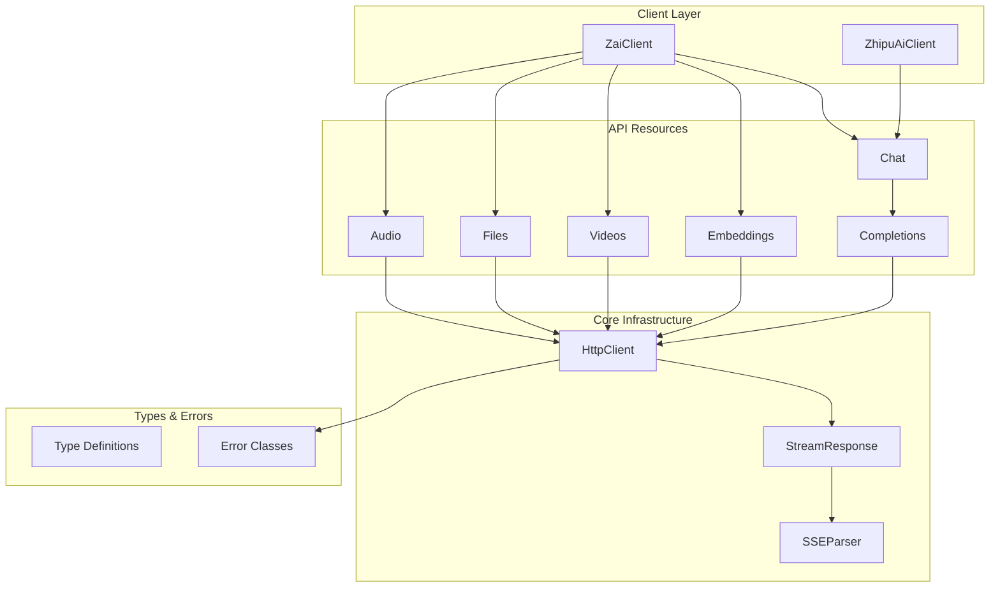

# Design Document: Z.ai TypeScript SDK

## Overview

本设计文档描述将 Z.ai Python SDK 翻译为 TypeScript SDK 的架构和实现细节。SDK 将作为 `@ai-cli/zai-sdk` 包放入 ai-cli 项目的 `packages/zai-sdk` 目录下。

SDK 采用与 Python 版本相似的架构模式：
- 主客户端类 (`ZaiClient`, `ZhipuAiClient`) 作为入口点
- 基于资源的 API 组织 (chat, embeddings, videos, files 等)
- 统一的 HTTP 客户端处理请求、重试和错误
- 流式响应支持 SSE 格式

## Architecture



## Components and Interfaces

### 1. Client Classes

```typescript
// src/client.ts
interface ClientOptions {
  apiKey?: string;
  baseUrl?: string;
  timeout?: number;
  maxRetries?: number;
  customHeaders?: Record<string, string>;
}

class BaseClient {
  protected httpClient: HttpClient;
  protected apiKey: string;
  protected baseUrl: string;
  
  constructor(options: ClientOptions);
  
  // Lazy-loaded API resources
  get chat(): Chat;
  get embeddings(): Embeddings;
  get videos(): Videos;
  get files(): Files;
  get audio(): Audio;
}

class ZaiClient extends BaseClient {
  static readonly DEFAULT_BASE_URL = 'https://api.z.ai/api/paas/v4';
}

class ZhipuAiClient extends BaseClient {
  static readonly DEFAULT_BASE_URL = 'https://open.bigmodel.cn/api/paas/v4';
}
```

### 2. HTTP Client

```typescript
// src/core/http-client.ts
interface RequestOptions {
  method: 'GET' | 'POST' | 'PUT' | 'DELETE' | 'PATCH';
  path: string;
  body?: unknown;
  query?: Record<string, unknown>;
  headers?: Record<string, string>;
  timeout?: number;
  stream?: boolean;
}

interface FinalRequestOptions extends RequestOptions {
  maxRetries?: number;
}

class HttpClient {
  constructor(
    baseUrl: string,
    apiKey: string,
    options: { timeout: number; maxRetries: number; customHeaders?: Record<string, string> }
  );
  
  request<T>(options: FinalRequestOptions): Promise<T>;
  requestStream<T>(options: FinalRequestOptions): AsyncIterable<T>;
  
  protected buildRequest(options: FinalRequestOptions): Request;
  protected shouldRetry(response: Response): boolean;
  protected calculateRetryDelay(attempt: number): number;
  protected makeStatusError(response: Response): APIStatusError;
}
```

### 3. API Resources

```typescript
// src/api/base.ts
abstract class BaseAPI {
  protected client: HttpClient;
  
  constructor(client: HttpClient);
  
  protected get<T>(path: string, options?: RequestOptions): Promise<T>;
  protected post<T>(path: string, body?: unknown, options?: RequestOptions): Promise<T>;
  protected delete<T>(path: string, options?: RequestOptions): Promise<T>;
}

// src/api/chat/completions.ts
class Completions extends BaseAPI {
  create(params: ChatCompletionCreateParams): Promise<Completion>;
  create(params: ChatCompletionCreateParams & { stream: true }): AsyncIterable<ChatCompletionChunk>;
}

// src/api/chat/index.ts
class Chat {
  readonly completions: Completions;
  constructor(client: HttpClient);
}
```

### 4. Stream Response

```typescript
// src/core/streaming.ts
class StreamResponse<T> implements AsyncIterable<T> {
  constructor(
    response: Response,
    castType: new (data: unknown) => T
  );
  
  [Symbol.asyncIterator](): AsyncIterator<T>;
}

class SSEParser {
  parse(line: string): SSEEvent | null;
  *iterLines(reader: ReadableStreamDefaultReader<Uint8Array>): AsyncGenerator<SSEEvent>;
}

interface SSEEvent {
  event?: string;
  data: string;
  id?: string;
  retry?: number;
}
```

## Data Models

### Chat Completion Types

```typescript
// src/types/chat/completion.ts
interface ChatMessage {
  role: 'system' | 'user' | 'assistant' | 'tool';
  content: string | ContentPart[];
  name?: string;
  tool_calls?: ToolCall[];
  tool_call_id?: string;
}

interface ContentPart {
  type: 'text' | 'image_url';
  text?: string;
  image_url?: { url: string };
}

interface ChatCompletionCreateParams {
  model: string;
  messages: ChatMessage[];
  temperature?: number;
  top_p?: number;
  max_tokens?: number;
  seed?: number;
  stop?: string | string[];
  stream?: boolean;
  tools?: Tool[];
  tool_choice?: string | ToolChoice;
  response_format?: ResponseFormat;
}

interface Completion {
  id: string;
  model: string;
  created: number;
  choices: CompletionChoice[];
  usage: CompletionUsage;
  request_id?: string;
}

interface CompletionChoice {
  index: number;
  message: CompletionMessage;
  finish_reason: string;
}

interface CompletionMessage {
  role: string;
  content: string | null;
  reasoning_content?: string;
  tool_calls?: ToolCall[];
}

interface CompletionUsage {
  prompt_tokens: number;
  completion_tokens: number;
  total_tokens: number;
  prompt_tokens_details?: { cached_tokens: number };
  completion_tokens_details?: { reasoning_tokens: number };
}
```

### Chat Completion Chunk Types

```typescript
// src/types/chat/chunk.ts
interface ChatCompletionChunk {
  id: string;
  model: string;
  created: number;
  choices: ChunkChoice[];
  usage?: CompletionUsage;
}

interface ChunkChoice {
  index: number;
  delta: ChoiceDelta;
  finish_reason: string | null;
}

interface ChoiceDelta {
  role?: string;
  content?: string;
  reasoning_content?: string;
  tool_calls?: DeltaToolCall[];
}
```

### Embedding Types

```typescript
// src/types/embeddings.ts
interface EmbeddingCreateParams {
  model: string;
  input: string | string[];
  dimensions?: number;
  encoding_format?: string;
}

interface EmbeddingResponse {
  object: 'list';
  data: Embedding[];
  model: string;
  usage: { prompt_tokens: number; total_tokens: number };
}

interface Embedding {
  object: 'embedding';
  index: number;
  embedding: number[];
}
```

### Video Types

```typescript
// src/types/video.ts
interface VideoCreateParams {
  model: string;
  prompt?: string;
  image_url?: string | string[];
  quality?: 'quality' | 'speed';
  with_audio?: boolean;
  size?: string;
  duration?: number;
  fps?: number;
}

interface VideoObject {
  id: string;
  model: string;
  task_status: 'PROCESSING' | 'SUCCESS' | 'FAIL';
  video_result?: VideoResult[];
}
```

### File Types

```typescript
// src/types/files.ts
interface FileCreateParams {
  file: Blob | File;
  purpose: 'fine-tune' | 'retrieval' | 'batch' | 'voice-clone-input';
}

interface FileObject {
  id: string;
  object: 'file';
  bytes: number;
  created_at: number;
  filename: string;
  purpose: string;
}

interface FileDeleted {
  id: string;
  object: 'file';
  deleted: boolean;
}
```

## Correctness Properties

*A property is a characteristic or behavior that should hold true across all valid executions of a system-essentially, a formal statement about what the system should do. Properties serve as the bridge between human-readable specifications and machine-verifiable correctness guarantees.*

### Property 1: Client Configuration Validation

*For any* valid ClientOptions with apiKey, baseUrl, timeout, and maxRetries, creating a client SHALL store these values correctly and use them in subsequent requests.

**Validates: Requirements 1.1, 1.2, 1.7, 1.8**

### Property 2: API Key Environment Fallback

*For any* client creation without explicit apiKey, when ZAI_API_KEY environment variable is set, the client SHALL use that value for authentication.

**Validates: Requirements 1.3**

### Property 3: Missing API Key Error

*For any* client creation without apiKey parameter and without ZAI_API_KEY environment variable, the client SHALL throw a ZaiError.

**Validates: Requirements 1.4**

### Property 4: Request Header Construction

*For any* HTTP request made by the SDK, the request SHALL include Authorization header with Bearer token, Content-Type header, and SDK version header.

**Validates: Requirements 2.1**

### Property 5: Retry on Retryable Errors

*For any* request that receives a timeout, 429, or 5xx response, the HttpClient SHALL retry up to maxRetries times with exponential backoff delay.

**Validates: Requirements 2.2, 2.3, 2.4**

### Property 6: Error Type Mapping

*For any* HTTP error response, the SDK SHALL throw the corresponding error type: 400→APIRequestFailedError, 401→APIAuthenticationError, 429→APIReachLimitError, 500→APIInternalError, 503→APIServerFlowExceedError.

**Validates: Requirements 5.1, 5.2, 5.3, 5.4, 5.5**

### Property 7: Error Class Hierarchy

*For all* error classes (APIRequestFailedError, APIAuthenticationError, etc.), they SHALL extend the base ZaiError class.

**Validates: Requirements 5.8**

### Property 8: Temperature Clamping

*For any* chat completion request with temperature <= 0, the SDK SHALL set do_sample to false and temperature to 0.01. *For any* temperature >= 1, the SDK SHALL clamp it to 0.99.

**Validates: Requirements 3.7, 3.8**

### Property 9: Stream Response Type

*For any* chat completion request with stream=true, the SDK SHALL return an AsyncIterable that yields ChatCompletionChunk objects. *For any* request with stream=false or undefined, the SDK SHALL return a Completion object.

**Validates: Requirements 3.3, 3.4, 2.7**

### Property 10: SSE Stream Parsing

*For any* SSE stream response, the StreamResponse SHALL correctly parse SSE format (event, data, id fields) and yield parsed JSON objects until [DONE] marker.

**Validates: Requirements 7.1, 7.2, 7.3**

### Property 11: Chat Completion Parameters

*For any* chat completion request, the SDK SHALL accept model and messages as required parameters, and temperature, top_p, max_tokens, seed, stop, tools as optional parameters.

**Validates: Requirements 3.1, 3.2, 3.5**

### Property 12: Embedding Input Flexibility

*For any* embedding request, the SDK SHALL accept both single string and array of strings as input parameter.

**Validates: Requirements 4.1, 4.2**

### Property 13: Video Generation Parameters

*For any* video generation request, the SDK SHALL accept quality, size, fps, and with_audio as optional parameters.

**Validates: Requirements 8.3**

## Error Handling

### Error Class Hierarchy

```typescript
// src/core/errors.ts
class ZaiError extends Error {
  constructor(message: string);
}

class APIStatusError extends ZaiError {
  readonly status: number;
  readonly response: Response;
  
  constructor(message: string, response: Response);
}

class APIRequestFailedError extends APIStatusError {}      // 400
class APIAuthenticationError extends APIStatusError {}     // 401
class APIReachLimitError extends APIStatusError {}         // 429
class APIInternalError extends APIStatusError {}           // 500
class APIServerFlowExceedError extends APIStatusError {}   // 503

class APIConnectionError extends ZaiError {
  readonly request: Request;
  constructor(message: string, request: Request);
}

class APITimeoutError extends APIConnectionError {
  constructor(request: Request);
}

class APIResponseValidationError extends ZaiError {
  readonly response: Response;
  readonly data: unknown;
  constructor(response: Response, data: unknown);
}
```

### Error Mapping Logic

```typescript
function makeStatusError(response: Response, body: string): APIStatusError {
  const message = `Error code: ${response.status}, with error text ${body}`;
  
  switch (response.status) {
    case 400: return new APIRequestFailedError(message, response);
    case 401: return new APIAuthenticationError(message, response);
    case 429: return new APIReachLimitError(message, response);
    case 500: return new APIInternalError(message, response);
    case 503: return new APIServerFlowExceedError(message, response);
    default: return new APIStatusError(message, response);
  }
}
```

## Testing Strategy

### Unit Tests

单元测试用于验证特定示例和边界情况：

1. **Client Tests**
   - 测试默认 base URL 值
   - 测试环境变量回退
   - 测试缺少 API key 时的错误

2. **Error Tests**
   - 测试每个 HTTP 状态码对应的错误类型
   - 测试错误类继承关系

3. **SSE Parser Tests**
   - 测试各种 SSE 格式的解析
   - 测试 [DONE] 标记处理

### Property-Based Tests

属性测试用于验证跨所有输入的通用属性：

1. **Property 1: Client Configuration** - 使用 fast-check 生成随机配置选项
2. **Property 4: Request Headers** - 验证所有请求都包含必需的头部
3. **Property 5: Retry Logic** - 模拟各种错误响应验证重试行为
4. **Property 8: Temperature Clamping** - 生成随机温度值验证钳制逻辑
5. **Property 10: SSE Parsing** - 生成随机 SSE 数据验证解析正确性

### Testing Framework

- **Unit Testing**: Vitest
- **Property-Based Testing**: fast-check
- **Mocking**: msw (Mock Service Worker) for HTTP mocking

每个属性测试配置为运行至少 100 次迭代。

## File Structure

```
ai-cli/packages/zai-sdk/
├── package.json
├── tsconfig.json
├── src/
│   ├── index.ts                 # Main exports
│   ├── client.ts                # ZaiClient, ZhipuAiClient
│   ├── core/
│   │   ├── index.ts
│   │   ├── http-client.ts       # HttpClient
│   │   ├── streaming.ts         # StreamResponse, SSEParser
│   │   ├── errors.ts            # Error classes
│   │   └── constants.ts         # Default values
│   ├── api/
│   │   ├── base.ts              # BaseAPI
│   │   ├── chat/
│   │   │   ├── index.ts         # Chat resource
│   │   │   └── completions.ts   # Completions API
│   │   ├── embeddings/
│   │   │   └── index.ts         # Embeddings API
│   │   ├── videos/
│   │   │   └── index.ts         # Videos API
│   │   ├── files/
│   │   │   └── index.ts         # Files API
│   │   └── audio/
│   │       └── index.ts         # Audio API
│   └── types/
│       ├── index.ts             # Type exports
│       ├── chat/
│       │   ├── completion.ts
│       │   └── chunk.ts
│       ├── embeddings.ts
│       ├── video.ts
│       ├── files.ts
│       └── audio.ts
└── tests/
    ├── client.test.ts
    ├── http-client.test.ts
    ├── streaming.test.ts
    ├── errors.test.ts
    └── properties/
        ├── client.property.test.ts
        ├── temperature.property.test.ts
        └── sse-parser.property.test.ts
```
